## [Homework 5](http://www.yurulin.com/class/spring2016_datamining/slides/hw5.pdf)

[Chukun Xia, chx26](mailto:chukun.xia@pitt.edu)

### Task 1 (Text Mining) 

1. Plot the histogram of number of documents per topic. Find and list the four most popular topics in terms of number of documents.

    - Histogram of number of documents per topic

        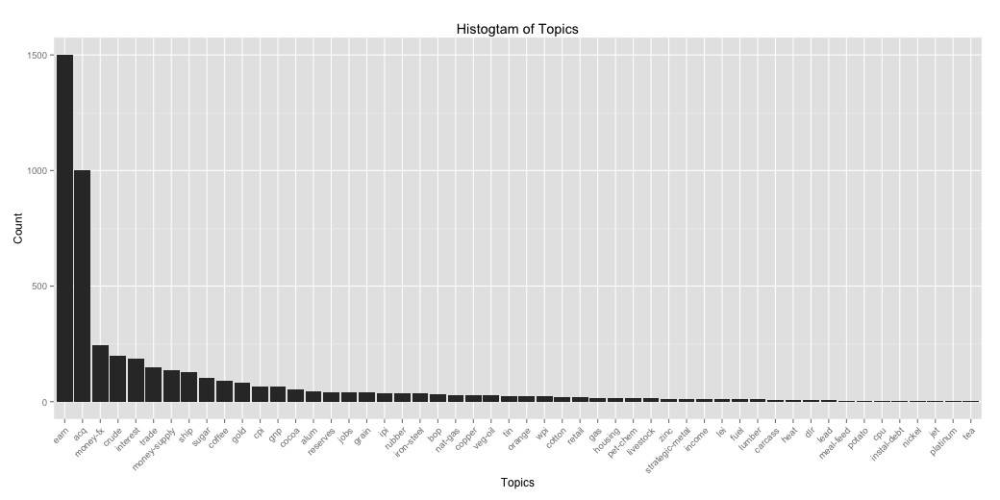

    - The four most popular topics in terms of number of documents

        ```R
            # earn      acq money-fx    crude 
            # 1500     1000      246      200
        ```

2. Extract contents in these top 4 topics as your corpus. Run pre-processing on this corpus and use terms that appear at least four times in the corpus to create a term-document matrix. Use the term-document matrix to generate an MDS plot where each node represents a document with color indicating its topic.

    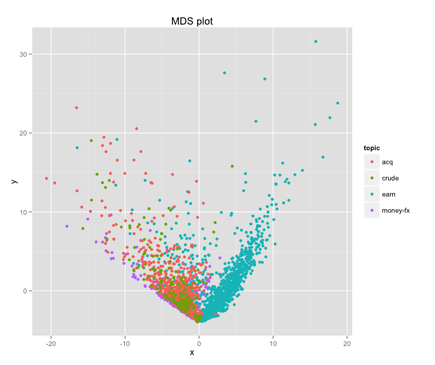

3. Apply TFIDF weighting, latent semantic analysis (LSA) and non-negative matrix factorization (NMF) on the term-document matrix. Generate MDS plots corresponding to these matrices (TFIDF weighted matrix, LSA approximated matrix, and NMF approximated matrix).

    - MDS - tf-idf
        
        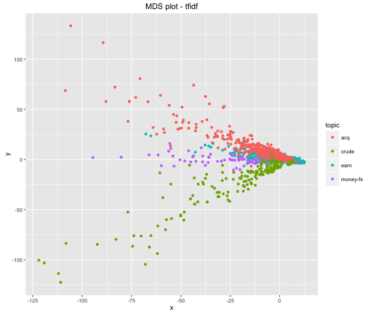

    - MDS - LSA

        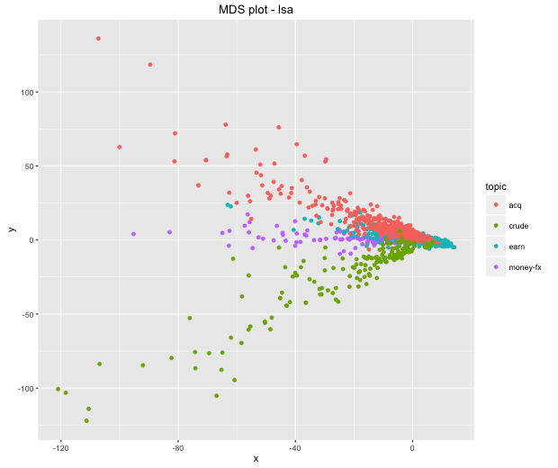

    - MDS - NMF

        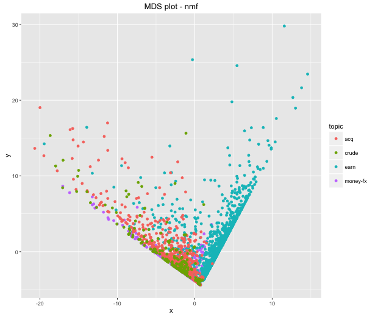

4. Write down your observation based on these plots.

    - All the MDS plots follow a same pattern, by following which four corpus derive from a commons spot, and then stretch into different directions. It means that there are common features in all the four corpus, and also different identities within themselves. As for this spcial case, in which the MDS plot are mapped from document sets, the "origin spot" is documents that containing majorly words that commonly used in all type of documents, while the "branches" are documents that written by representative words under that spcific topic.
    - There are strictly constrained edges in the MDS by NMF, while others not. It is because the coordinates in MDS are transformed from non-negative matrices who have strict borders.

    

### Task 2 (Network Analysis)

1. Create an artist-to-artist network based on how users listen to the same artists’ work. Load user_artists.csv dataset, and extract data with artists who were listened equal or above 1500 times (weight ≥ 1500). Extract the top 30 most frequently listened artists as the nodes. Generate a network with edge weights ≥ 5, i.e., two artists have a link if they are listened by at least 5 common users. Load artists.csv to to replace artistID with artist names. List the names of the top 10 artists and their number of listening.

    - 30 most frequently listened artists (ID)
        
        ```R
        #  [1] 289  72  89 292 498  67 288 701 227 300 333 344 378 679 295 511 461 486 190 163  55 154
        # [23] 466 257 707 917 792  51  65 475
        ```

    - network, size of nodes is determined by their weight

        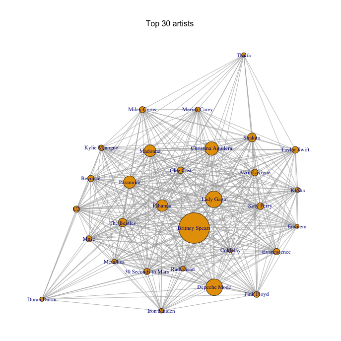

    - top 10 artists

        ```R
            #                  name  weight
            # 1      Britney Spears 2393140
            # 2        Depeche Mode 1301308
            # 3           Lady Gaga 1291387
            # 4  Christina Aguilera 1058405
            # 5            Paramore  963449
            # 6             Madonna  921198
            # 7             Rihanna  905423
            # 8             Shakira  688529
            # 9         The Beatles  662116
            # 10         Katy Perry  532545
            # 11      Avril Lavigne  525844
            # 12       Taylor Swift  525292
            # 13        Evanescence  513476
            # 14          Glee Cast  506453
            # 15            Beyoncé  499318
            # 16                 U2  493024
            # 17        Miley Cyrus  489065
            # 18 30 Seconds to Mars  485532
            # 19               Muse  485076
            # 20         Pink Floyd  466104
            # 21      Kylie Minogue  449292
            # 22          Radiohead  385306
            # 23              Ke$ha  384405
            # 24       Mariah Carey  384307
            # 25          Metallica  371916
            # 26        Iron Maiden  368710
            # 27             Thalía  350035
            # 28        Duran Duran  348919
            # 29           Coldplay  330757
            # 30             Eminem  321011
        ```

2. Identify the community structure in the network by using the modularity-based community detection algorithm. Plot the network with the detected community structure (use ’plot’) and the dendrogram (use ’dendPlot’).

    - modularity community

        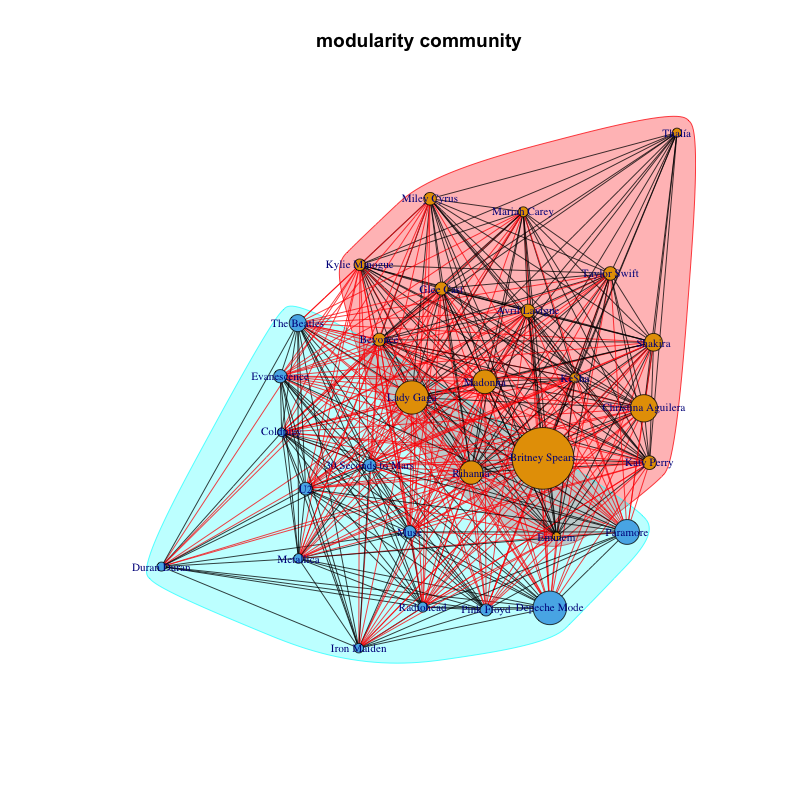
    
    - dendrogram plot

        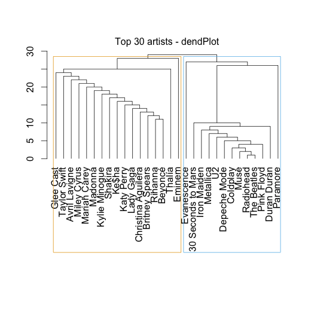


3. Identify the most central nodes in the network based on different centrality measures, degree centrality, closeness centrality, betweenness centrality, and PageRank. Plot different networks where the nodes are sized based on the centrality measures. Highlight the top 5 nodes with the highest centrality measures in each network. [hint](http://www.yurulin.com/class/spring2016_datamining/src/class10.html)

    - Degree centrality

        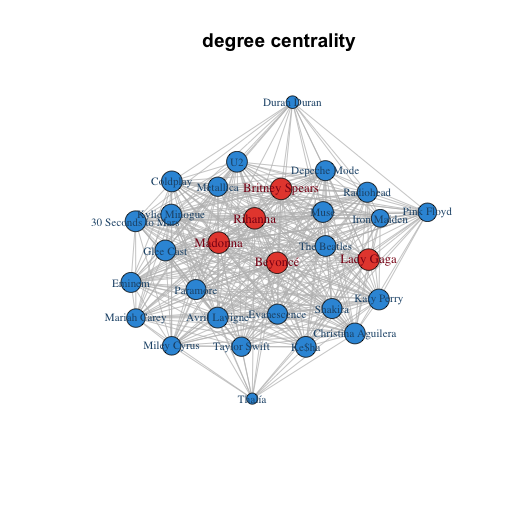

    - Closeness centrality

        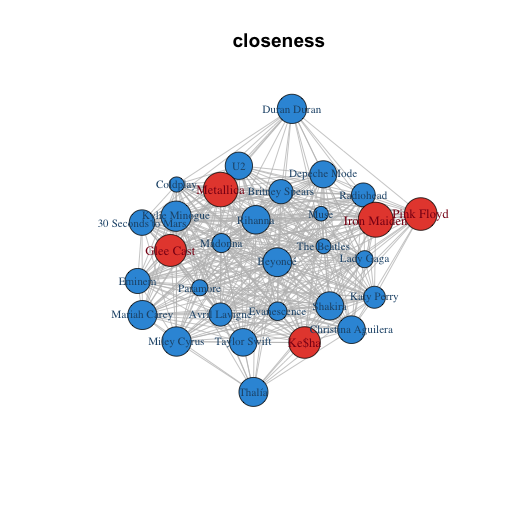

    - between centrality

        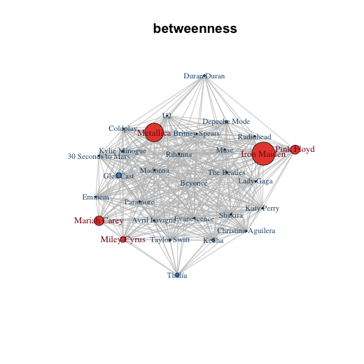
    
    - PageRank

        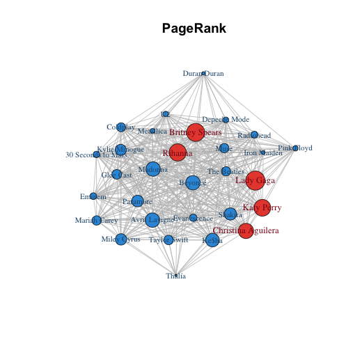

4. Write down your observation based on these plots.

    - High-ranking spots calculated by degree centrality have the most dense net work around them; 
    - Closeness describes how easily one nede could reach all other nodes, and betweenness stands for how likely the shortest paths would pass by this certain node, and a node tends to have higher PageRank if nodes connecting to it also has high PageRank. These features are not quite observable through these graphs;
    - Choose appropriate centrality to optimize its utility.


### Task 3 (Recommendation)

1. In the dataset, load the user_rated movies.csv & movies.csv data. Create a movie rating matrix from these data, and in this matrix, only consider movies that were rated by at least 50 users, and users that rated at least 10 movies.

    ```R
        rt.count <- sort(table(rated$movieID), decreasing = T)
        rt.count.50 <- rt.count[rt.count >= 50]
        dim(rt.count.50) # 3261 movies
    ```

    ```R
        usr.count<-sort(table(rated$userID), decreasing = T)
        usr.count.10<-usr.count[usr.count>=10]
        usr.ids<-unique(as.factor(rownames(usr.count.10)))
        length(usr.ids) # 2113 users
    ```

2. Run and test a recommender system built with different recommendation methods, including random, popular, user-based collaborative filtering, item-based collaborative filtering. Evaluate the different methods by using k-fold cross-validation (k=5). Generate a performance table in terms of performance measures MAE, MSE and RMSE as follows. 

    ```R
        #        Random   Popular     UBCF      IBCF
        # RMSE 2.805810 1.0985166 1.387932 1.8614928
        # MSE  7.872571 1.2067387 1.926354 3.4651556
        # MAE  2.407871 0.6426194 1.137060 0.9989926
    ```

3. Write down your observation based on the performance table.

    - Random recommendation have the largest errors, which perform as baseline, and other recommender are better than the baseline;
    - "Popular" recommender has the best performance, following by "UBCF", which performs better than "IBCF". It may be explained as the blockbusters may attach almost everyone's attention so that many people would like to watch them, while the variety of users' preferences and categories of movies bring some noise to "UBCF" and "IBCF", so the performances are affected.


